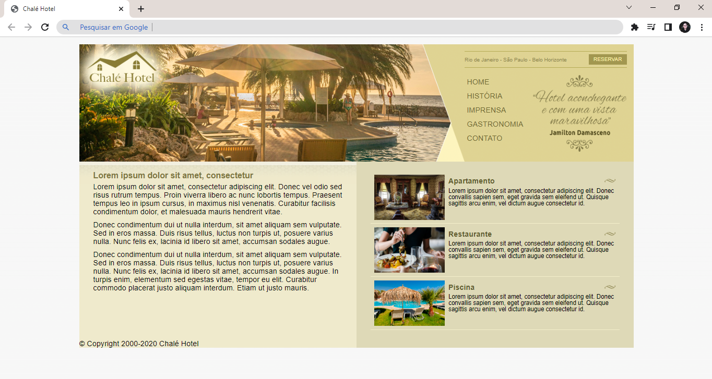

# Site Chalé Hotel
Projeto desenvolvido no curso "Desenvolvimento Web Completo 2022".

Clique <a href="https://isabellacpmelo.github.io/chale-hotel/">aqui</a> para acessar o projeto.

<a href="https://isabellacpmelo.github.io/chale-hotel/"> 

## Ferramentas utilizadas:
* HTML5
* CSS3

## Print do Projeto

### Página Principal

